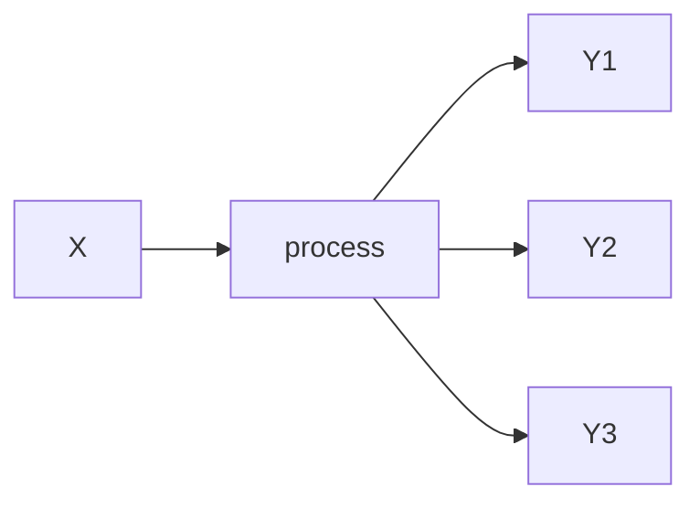

# Topic 1: Introduction to FQR + Evolutionary first principles

# Goals
1. Introduce ourselves 
2. Understand the structure of the course + syllabus
3. Review of evolutionary principles
* Deterministic Processess
* Stochastic Processes
* Evolutionary Systems through the lenses of Deterministic and Stochastic Processes
4. (If time permits), a tour of the VACC
---
# Evolutionary Theory... as fundamentals
... posits that living things are systems that change over space and time.

## These changes are driven by processes that can be measured and predicted (to some degree)
1.Some processes are deterministic: Have predictable outcomes that are repeatable and devoid of randomness

* Useful sometimes to think of point estimates as predictive outcomes

2.Some processes are stochastic: Have outcomes, that can be described, yet they governed by randomness

* Useful to think of distributions as “predictive” outcomes 

## Example of Deterministic processes 

### examples

$$
a = F/m 
$$
> Newton's classic formula of accelation. $a$ is acceleration, $F$ is force, and $m$ is mass.
> 
$$
y =x(1+r/m)^{Ym}
$$
> Formula for compound interest. $x$ is the current value, $y$ is future value. $r$ is the interest rate, $m$ is months, $Y$ is years.

## Example of Stochastic processes 

### examples

$$
P(X = i) = ...something...
$$
>Any equation that attempts to predict "states".. for example the weather...

### A Bernoulli process
$$
P(Success) = P(X=1) = p
$$

> Where 1 is "heads"

$$
P(Failure) = P(X=0) = 1 - p
$$

>Where 0 is "tails"

### A Binomial process (many bernoulli processess)

$$
P(X = k) = \binom{n}{k}p^k(1-p)^{n-k}
$$

where $k$ is the number of successes and $n$ is the number of trials.

# How does this connect with Evolution?
Evolution is the study of how and why biological systems change as a function of time. We may want to think as the possible underlyign drivers of these process as random or deterministic. 

## What are the possible outcomes of evolutionary change?

1. **Directional changes**: the allele frequency or phenotypic state changes over time since underlying processess go in the same direction.
2. **Equilibrium changes**: the allele frequency or phenotypic state stays the same over time because of opposing forces.
3. **No Evolution**: a null model? 

## Core evolutionary processess:
1. **Mutation:** *Random* process that introduces variation.
2. **Drift:** *Random* process that reduces variation due to finite sampling and may give rise to spatial and temporal population structure.
3. **Selection:** *Deterministic* process that reduces variation (if directional) or maintans variation (if equilibrium).
4. **Migration:** *Deterministic* process that homogenizes variation across space.
5. **Recombination:** *Complex* process that shuffless variation across genomes.

## The challenge of the class
How can we predict and characterize these process in the wild?
