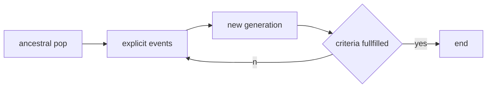

# Topic 5: Population Genetic simulators

Simulation is the backbone of data-driven evolutionary biology. In general there are three types of simualtion frameworks:

* Coalescent
* Forward
* Resampling 

## Coalescent, backwards-in-time (BiT), simulators

### The coalescent process

It is a backwards-in-time simuations that seeks to reconstruct the genealogy of a sample based on the basics of the Kingsman coalescent (https://academic.oup.com/genetics/article/156/4/1461/6048436). The model depends first and foremost on the **"Coalescent Process"** a theoretical tools that describes the process by which individuals (evolving in tiem) represent samples from a genealogy that eventually coalesces back in time to a single common ancestor. Notably, this genealogical process is independent of the mutation process.  Under the Kingsman' $N$ coalescent process the rate at which alleles are expected to coalescence is the rate $\lambda_G$ of $k$ alleles (where $G$ stands for genealogy):

$$ 
\lambda_{G|k} = \frac{k(k-1)}{4N}  
$$

Where $N$ is the population size of the underlying population and $k$ is the number of alleles in a population. Notice that in the case when $k = 2$ the probability (or rate) at which alleles coalesce back in time is simply:   

$$
\lambda_{G|2} = \frac{2}{4N} =  \frac{1}{2N}
$$

Also note that the parameter $N$ can be expressed in terms of $N_e$ the effective population size of a species. Nevertheless, this formula gives rise to the coalescent structure of the simulation.

### The standard binomial process (how variation is sampled over time)

Most coalescent simulators use the assumptions of the Wright-Fisher model. In this scenario, we assume that we have a population of $N$ diploid individuals. We also assume that there are $i$ copies of alleles of gene $\alpha$ and that those alleles are called $A$ and $a$. Since this is a bi-allelic locus (i.e., $k=2$), it must be the case that there are $i$ copies of allele $a$ and $2N-i$ copies of $A$. As we have covered in the past, the probability of getting $n$ copies of allele $a$ in the generation $t_{+1}$ by randomly sampling is defined as a binomial process:

$$
P(n|i) = \binom{2N}{n}(\frac{i}{2N})^n(1-\frac{i}{2N})^{2N-n}
$$

Please note that is exactly what we have learned in the past, yet we have replaced $p$ with the explicit formula $\frac{i}{2N}$.

### The backwards-in-time binomial process

We can modify this process to become a "backwards-in-time" by assuming that the population size changes in time in a "Markovian manner"... Such that $N_{t}$ only depends on $N_{t-1}$, $N_{t-2}$ depends on $N_{t-1}$, and so on.... In this case we can generalize the binomial sampler as:

$$
P(n|i) = \binom{2N_{t-1}}{n_{t-1}}(\frac{i_t}{2N_t})^{n_{t-1}}(1-\frac{i}{2N_t})^{2N_{t-1}-n_{t-1}}
$$

This process proceeds backswards in time until the alleles coalesce.. or "disapear." A important property of this process is that each coalescent event is independent of each other so that the coealescent trajectory (i.e., $H$)of any given individual (or allele) is described as a product from the initial time $t$, backwards in time to time $T$:

$$
Pr(H) = \prod_{{t=1}}^{T} Pr(i_{t-1}|i_t)
$$
 
 ### Recombination in the coalescent process

Mathematical adavcements to the Kingman coalescent have allowed for the introduction of more nunace elements to the coalescent. For example Hudson 2002 developed a model for recombination simulation (https://academic.oup.com/bioinformatics/article/18/2/337/225783). The model is simple and elegant and assumes that a limited number of recombination events can occur in a population $\rho$ as a function of the populations effective size $N_e$ and the genomic rate of chromosomal recombination $r$, or:

$$
\rho = 4N_er
$$

 ### Mutation in the coalescent process

Similar to recombination, the coalescent process also makes a distinction bewtween the process of "genomic mutation", $\mu$ (the rate at which mutations appear in the genome; i.e., a Poisson process), and the levels at which mutations appear, and move through, populations. The **population-scaled mutation rate** is defined as:

$$
\theta = 4N_e\mu
$$

Notably, the rate of mutations that is expected to occur in a given "branch" of the genealogy tree is directly proportioal to the lenght of the branch (which in time is a a function of time):

$$
E(M) = \theta t_i
$$

Different simulators have more or less additional features, but at its core all "off-the-shelf" simulators use these basic parameters.

## Forward-in-time (FiT) simulators

Unlike its coalescent counterpart, FiT simulators seek to simulate explicity evolutionary events occuring in a population evolging in real time. These simulators are usually very powerful (since they are **explicit**) yet very computatioanlly expensive (as they have to control for multiple **explicit** elemtents).  These simulators often start their runtime with an "ancestral" populations with known properties, they then evolve this populations under given conditions until a set number of generations have been run, or another condition has been met:

