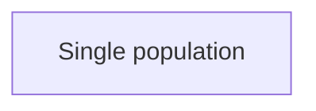
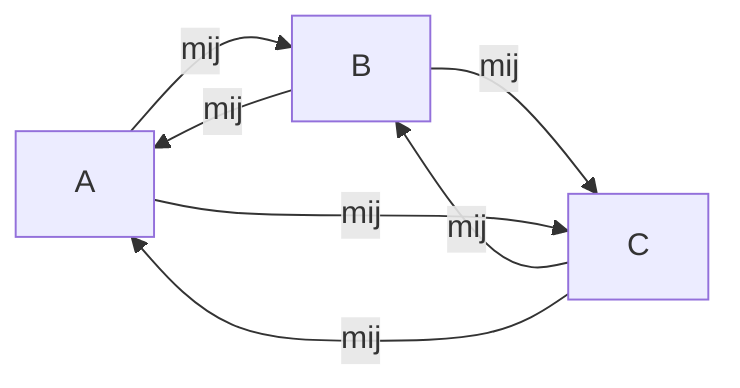
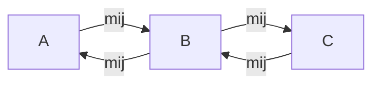

# Demographic models

Deographic model seek to capture the changes in genetic variation over time in popultion as a reult of neutral processes related to sampling, migration, space dsitribution and others. Notabky, while they do not implictly include selection in the ir frameworks, demograpy is key for understanding adaptive capacity.

## Adaptation from standing genetic variation depends on demography

The classical model of adaptation in population genetics assumes that adaptation to a novel challenge may occur through the apperance of a **novel**, highly adaptive, mutation that sweeps through the population (i.e., a hard sweep model). Empirical data has shown that these hard sweeps are in fact very rare in nature, for most metazoan and plant populations anyways. Instead data has shown that most adaptation proceeds from variants that already exist in the population, i.e., adaptation from standing genetic variation. Herein lies the crux of demography, since demography is the key process that drives the generation and maintenance of standing genetic variation! Hence demography is key for understanding adaptation.

## The "basic" models of demography

### Panmixia

### Island Model

### Stepping Stone model

### Historically informed
Our discussion of the gravel model. Paper: https://www.pnas.org/doi/full/10.1073/pnas.1019276108
