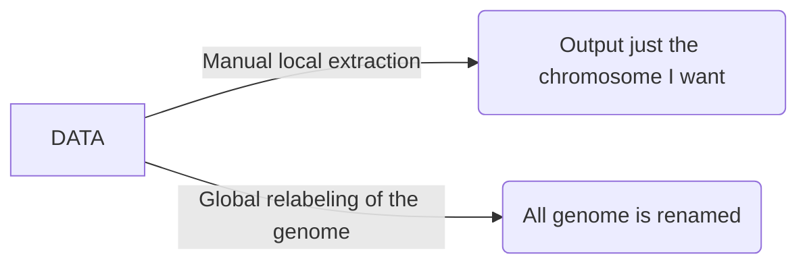

# *Data challenge* (-prac 2) my genome file and my annotation file do not match! *mon dieu!*

A problem as old as time (not really, but humor me). As computational biologists we are often interested in investigating DNA sequences not just at the level of nucleotides but their potential funtional consequences. The challenge, however, is that, due to the inherent data complexity of DNA data, sequence data, variation data, and functional data are stored in different format that may not integrate into each other in an intuitive way. For example

1. The *standard* way of storing DNA sequences is the FASTA file
```
>NAME of sequences (e.g., "chromosome 2L" gene, chromosome scaffold); ind1"
ACTGACTGACTGCGTGGCC...
>NAME of sequences (e.g., "chromosome 2L" gene, chromosome scaffold); ind2"
ACTGACTGACTGCGCGGCC...
>NAME of sequences (e.g., "chromosome 2L" gene, chromosome scaffold); ind3"
ACTGACTGACTGCCTGGCC...
```
2. The *standard* way of storing variation among sequences is the VCF file
```
>##fileformat=VCFv4.3
##fileDate=...
##source=...
##reference=...
##contig=<taxonomy=info>
##phasing=....
##INFO=<....>
##FILTER=<....>
##FORMAT=<....>
```
|CHROM|POS |ID|REF|ALT|QUAL|FILTER|INFO|FORMAT|ind1|ind2|ind3|
|--|-- |--|--|--|--|--|--|--|--|--|--|
X  |   12345  |  snp_111  | G  |   A   |   29  |  PASS   | NS=3;DP=14;AF=0.5;DB;H2   |  GT:GQ:DP:HQ  | 0/0:48:1:51,51 |  1/0:48:8:51,51   |1/1:43:5:.,.|
2L  |   1258  |  snp_125  | C  |   T   |   29  |  PASS   | NS=3;DP=14;AF=0.5;DB;H2   |  GT:GQ:DP:HQ  | 0/0:89:1:25,51 |  0/1:48:8:78,51   |1/0:43:5:.,.|

3. The *standard* way of storing annotations in genomes is some form of GFF file (gene/generic/general feature files; or similar)

| seqid | source | type | start | end | score | strand | phase | attributes |
| -- | -- | -- | -- | -- | -- | -- | -- | -- |
| chr2L | MAKER | gene | 5600 | 8900 | 0.95 | + | 2 | gene QXD1 |
| chr3R | BUSCO | exon | 15899 | 157800 | 0.65 | - | 0 | gene ppk785 |


## Case study for *Pycnopodia*

**A haplotype of interest**: A study in the sea star _Pycnopodia_ has identified several genes of  interest. We would like to extract these genes from the genome of pycno for further study. 

I have already downloaded the genome from NCBI and have stored it in our shared VACC repository.
```bash
ls /gpfs1/cl/biol6210/prac2/pycno_genome.fqr.fasta
```

## Adquiring the genome

1. Move to your scratch directory **(known skill!)**
2. create a working folder for this challenge
```bash
mkdir pycno_challenge
```
3. move into your new folder
```bash
cd pycno_challenge
```
4. Check what is inside this new folder
```bash
ls -l ./
##this is the same as just ls -l
```
5. Copy the genome from the repo to your folder
```bash
cp /gpfs1/cl/biol6210/prac2/pycno_genome.fqr.fasta ./
## cp <from+file> <to>
```
6. Check what is inside this new folder... again.
```bash
ls -l ./
```

## Exploring the genome
Explore the heads and tails command
```bash
head -n 50 pycno_genome.fqr.fasta
## head -n <nlines> <file>
```

```bash
tail -n 50 pycno_genome.fqr.fasta
## tail -n <nlines> <file>
```

## Adquiring the gene feature file
```bash
cp /gpfs1/cl/biol6210/prac2/GeneFeatureFile.gtf ./

head -n 10 GeneFeatureFile.gtf
```
Do we observe something strange?  ... What is going on?

### The names appear not to match! how can we check?
We can use computational tools combined with a basic understanding of the file properties to explore the file's content without any need to open a gigantic genome file.

* For example, we know that, by desing, all the chromosome names in a fasta file are named using the `>` symbol. So we can use a function to _extract_ all the information attached to lines containing `>`. -- **enter `grep`**.

```bash
grep ">" pycno_genome.fqr.fasta
```

## Emailing the author...

**You**: Dear author, I am interested in conducting follow up analyses on the genome of *Pycnopodia* that you published in 2018. I am interested in extracting  some loci. Yet, when I download the genome from NCBI, the chromosomes are labebled with the standard NCBI genomic nomenclature (JASTWB0100...) and I cannot cross-validate scaffold "pycn_heli.0008". Do you have any thoughts about how to cross-validate scaffolds?

---
**Author**: Dear X, my appologies that you are experiencing this road block! Our analyses was conducted before the genome was made public using our own chromosome nomenclature. Here is a file with the corresponding association of the "pycn_heli" names with the JASTWB ids.

```bash
cp /gpfs1/cl/biol6210/prac2/JASTWB01_contigs.tsv ./
```
---
## Exploring the corresponding file
```bash
head JASTWB01_contigs.tsv
```

# What to do?


What is  the **best use of your time**? ... What is the **best use of *future you's* time**? For example what about if later on you want to look at many other loci.. or if you had multiple loci to extract to begin with. I submit to you that a global solution that re-labels the genome is the overall most efficient solution, despite having a larger initial investment (i.e., having to code the relabeling pipeline) it will be an overall more efficient use of research resources.
  
### Lets recap what we have so far...
```bash
# we made a new folder
mkdir pycno_challenge
cd pycno_challenge

# We moved the sea start genome to it
cp /gpfs1/cl/biol6210/prac2/pycno_genome.fqr.fasta ./

# we moved the GFF file to the folder
cp /gpfs1/cl/biol6210/prac2/GeneFeatureFile.gtf ./

# we obtained a master file from the "author"
cp /gpfs1/cl/biol6210/prac2/JASTWB01_contigs.tsv ./
```

## Breaking down the code (lets take a reverse engineering approach!).
Lets break down what is going on here .... the _stack overflow_ approach! 
>**lets talk about stack overflow** for one minute...
```bash
master_file=./JASTWB01_contigs.tsv
working_file=./pycno_genome.fqr.fasta

cp ${working_file} ./pycno_genome_modnames.fasta

ith=$(cat ${master_file} | sed '1d' | wc -l)

for i in $(seq ${ith} )
 do
  name1=$(cat ${master_file} |  sed '1d' | awk '{print $1}' | sed "${i}q;d" )
  name2=$(cat ${master_file} |  sed '1d' | awk '{print $2}' | sed "${i}q;d" )
    echo "im an changing " $name2 " to " $name1 " when i = " $i
   sed -E -i "s/${name2}.+/${name1}/g" pycno_genome_modnames.fasta
 done
``` 

## What are the parts of the code?
### Variables declared by the user
```bash
master_file=./JASTWB01_contigs.tsv
working_file=./pycno_genome.fqr.fasta
```
here we are declaring environmental variables. This is a convient way to pass information to our script, code, multiple times while having user provided imput just once. Imagine how cumbersone it would to have to change one small paramter 30 times across a script.. vs. declaring a global parameter once ... and changing just that!

In unix, variables are often declared with the `=` simbol and recalled with the `$` symbol. We can always spot check a variable using `echo`. lets explore some variables... **NO SPACES ALLOWED between `=` and the other stuff!**

* We can always recall the value of a variable we can use `${variable}`

```bash
a=10
echo ${a}
```

### File generated in situ (to create data redundancy!; _failsafe_)
Why is the code asking us to do this? The reality is that it is not necessary but it is a failsafe custom. Basically, the way this code works, it constantly overwrites the original file. What about if we get this wrong? An easy solution is to introduce redundancy and safety copies to the process. 
```bash
cp ${working_file} ./pycno_genome_modnames.fasta
```
#### Commands to keep in mind:
1. `cp` copy `cp <file> <location>`
2. `mv` move or (_oddly_) rename `mv <file> <location>`

### Create a varible with number of itherations & introduction to loops
Before we can get at what the the `ith` varaiable means, we first need to take a deep dive into _loops_.
```bash
ith=$(cat ${master_file} | sed '1d' | wc -l)
```


#### A basic loop 1
```bash
for i in A B C
do
echo ${i}
done
```
Here the `${i}`  is the call that returns the value of `i`
#### Creating a sequence with `seq`
```bash
seq 10
#seq --help
```
#### A basic loop 2
```bash
for i in $(seq 10)
do
echo ${i}
done
```
Here we are using the power of the `$()` construction to transform the output of the `seq` function into a variable that is, at the same time, the input of the loop itself. This reveals the first path to "scaling up the code" because we can **nest** these variables into each other... `$(seq $a)`.
```bash
a=15
for i in $(seq $a)
do
echo ${i}
done
```
#### On local vs. global variables
Notice that our loop has two variables.. it has `a`, that is globally set, and it has `i`, that iterates inside the loop... **keep track of your variables!**  

### What does _loops_ have to do with `ith`
At this point we have covered loops. Yet, notice that we have always given the loop... either the actual objects to iterate over (`A B C`) or a number of given iterations `seq 15`. What about if we dont know how many iteration our loop may need?  That is the purpose of defining `ith`
```bash
master_file=./JASTWB01_contigs.tsv
ith=$(cat ${master_file} | sed '1d' | wc -l)
```
#### The layers of `ith`
1. `ith` is a global variable
2. `ith` is the output of nested commands ... `$()`
3. These command a **piped workflow** of commands `cat` --> `sed` --> `wc`

#### a. Piped workflow
Its a coding tool that uses the `|` symbol. This symbol "re-routes" the output of a function to another function, instead of reporting it to the user.
```bash
seq 15
``` 
```bash
seq 15 | head -n 3
seq 15 | tail -n 3
```
#### b. The `cat` command
Stands for _concatenate_ it is a versatile command with a few uses. Its most basic form is used to load the contents of a file into memory. Yet, a fancier application is to merge two, or more, files into 1. For example:
```bash
# assume that file_1.txt and file_2.txt exist
cat file_1.txt file_2.txt > newfile.txt
```
1. Notice we have a new symbol here: `>` is the universal unix symbol for **save to**. In enflish this command would translate to _concatenate_ file_1.txt and file_2.txt and _save to_ newfile.txt.

#### Making a chimera [mini challenge]
Can you create a code that takes the first 5 line of the genome and the last 5 lines of the gene feature file and merges them into an ungodly new chimeric file? can you make it a "**one liner command**"?

#### c. The `sed` command
`sed` is a [stream editor](https://www.gnu.org/software/sed/manual/sed.html). It is a very versatile program capable of manipulating text in variety of ways, some of which we will cover in this course.... though, an entire course could be devoted to `sed`.

>What funcions will we use `sed` for in this class?

1. Removing a row of text
2. Selecting a row of text
3. Search and replace a set of characters in a line(s) of text.

#### c. 1 `sed` to remove rows/lines of text
```bash
seq 10
seq 10 | sed "5d"
```
#### c. 2 `sed` to select rows/lines of text
```bash
seq 10 | sed "5q;d"
```
#### c. 3 `sed` to find and replace
One of the most powerful and widely used utilities of the program
```bash
echo "groovy UV cool cats"
echo "groovy UV cool cats" | sed "s/cats/mooses/g"
```
The general structure is `s/original/replacement/g`. In this particular sintax, the `s` a the front means to use the _substitute_ function and the `g` at the end means to apply this function _globally_. There are other options one can give `sed` but you will have to dig into the manual to learn these, which, is actually super interesting! 

* Here is one example:

```bash
head JASTWB01_contigs.tsv
head JASTWB01_contigs.tsv | sed "s/pycn_heli/SOMETHINGNEW/g"
```
#### d. The `wc` command
`wc` is a command that can be use to count the number of characters in a file or stream. in this particualr case the option `-l` tells `wc` to count the number of lines in the input file.
```bash
wc -l JASTWB01_contigs.tsv
```
### Lets circle back to `ith`
If we put toghther the different pieces of the puzzle we can infer that: `ith` is a varible whose value is defined by the output of several piped functions. These functions first load a variable called `master_file`, which we know is the chromosome correspondance file, then it removes the first line (i.e., the header), and the it count the number of lines remaining in the correspondance file. Why would we want to do this?
```bash
ith=$(cat ${master_file} | sed '1d' | wc -l)
```

## Finally, the loop that will replace names!
We are creating a loop that will go for `$ith` number of iterations.
```bash
for i in $(seq $ith)
 do
  name1=$(cat $master_file |  sed '1d' | awk '{print $1}' | sed "${i}q;d" )
  name2=$(cat $master_file |  sed '1d' | awk '{print $2}' | sed "${i}q;d" )
    echo "im an changing " $name2 " to " $name1 " when i = " $i
   sed -E -i "s/${name2}.+/${name1}/g" pycno_genome_modnames.fasta
 done
``` 
Inside the loop, two variables will be created `name1` and `name2`. These variables will have a value equal to many piped functions. We know `cat` and `sed`... what about `awk`?

### `awk` -- a data driven scripting langage!
Similar to `sed`, an entire class could be devoted to `awk`. This language is extremely versatile and can be use for very efficient data mining in unix. Here we will barely scratch the surface of its capabilities. In this course we will mostly use `awk` as a tool to extract information across entire columns in large and complex **files**... such as genomes, feature files, and other genomic datasets.

```bash
head $master_file
cat $master_file | awk -F  '\t' '{print $1}'
```
Here we are loading the file to memory, passing it to `awk` and then `awk` is printing the first column. 
* the `-F` parameter is called a **flag** and they are used to modify the behaviour of functions.
* ``awk`` _flags_ **modifier** `'{print...}'`
* `-F` means the divider of the file and `\t` means _tabs_ (this could be `,` or `;` or other dividers)
* The ``'{print $1}'`` is the core of the command and ``print $1`` means print the first column.
* **NOTICE-->** inside the `awk` command the `{ $1 }` is not a global variable, but rather a parameter inherent to `awk` ... _yes, this is exactly why coding can be conflusing!_ and needs to be practiced.
* How may we print the second column, third... fourth...

#### thus... what is this doing?
```bash
  name1=$(cat ${master_file} |  sed '1d' | awk '{print $1}' | sed "${i}q;d" )
```
1. load the `${master_file}`
2. remove the header
3. print the first column
4. extact row `${i}` ... recall here `${i}` will be supplied by the loop!
5. hence... when $i = 1$ ... `${name}` will be the first name in column 1 of the file!

* lets try that
```bash
i=1

name1=$(cat ${master_file} |  sed '1d' | awk '{print $1}' | sed "${i}q;d" )
echo ${name1}
```
This action... of arbritrarily setting `i = 1` is core to debugging!... 

* **Question -> what is `${name2}`?**

### Lets run a debugging run
Here we are going to use the `#` to "comment out" or "inactivate" a chunk of code, so that we can test the rest.

```bash
ith=$(cat ${master_file} | sed '1d' | wc -l)

for i in $(seq $ith)
 do
  name1=$(cat ${master_file} |  sed '1d' | awk '{print $1}' | sed "${i}q;d" )
  name2=$(cat ${master_file} |  sed '1d' | awk '{print $2}' | sed "${i}q;d" )
   echo "im an changing " $name2 " to " $name1 " when i = " $i
  # sed -E -i "s/${name2}.+/${name1}/g" pycno_genome_modnames.fasta
 done
``` 

### Finally, the renaming step
Its made of a modified `sed` command
```bash
sed -E -i "s/${name2}.+/${name1}/g" pycno_genome_modnames.fasta
```
1. We are implementing the flag `-i` ... that tells `sed` to overwite the file given as an input.
2. Notice that here we are not using the `cat` method because we dont just want to load the data in memory, we want the _actual_ file to be changed.
3. This is also why we created a copy of genome!
4. Lastly the flag `-E` is used to activate _special_ characters called **regular expressions**
* Regular expressions are general symbols that can capture multiple types of characters

| expression | meaning |
| -- | -- |
|^ | Start of string, or start of line in multi-line pattern|
|\A | Start of string|
|$ | End of string, or end of line in multi-line pattern|
|\Z | End of string|
|\b | Word boundary|
|\B | Not word boundary|
|.|Any character except new line (\n)|
|(a\|b)|a or b|
|+| this is a modifer that means "1 or more"|

```bash
sed -E -i "s/${var1}.+/${var2}/g" file.txt
```
vs
```bash
sed -E -i "s/${var1}/${var2}/g" file.txt
```
recall...
```bash
head -n 50 pycno_genome.fasta
```
# Lets run it! Yet...
Is there a plot twist? -- yes... its **slow**

```bash
master_file=./JASTWB01_contigs.tsv
working_file=./pycno_genome.fqr.fasta

cp ${working_file} ./pycno_genome_modnames.fasta

ith=$(cat ${master_file} | sed '1d' | wc -l)

for i in $(seq ${ith} )
 do
  name1=$(cat ${master_file} |  sed '1d' | awk '{print $1}' | sed "${i}q;d" )
  name2=$(cat ${master_file} |  sed '1d' | awk '{print $2}' | sed "${i}q;d" )
    echo "im an changing " $name2 " to " $name1 " when i = " $i
   sed -E -i "s/${name2}.+/${name1}/g" pycno_genome_modnames.fasta
 done
``` 

# The solution 

Lets submit this script as a SLURM job to the VACC!! Start by copying the code below and saving it to a *new file* called `my_renaming_script.sh`


```bash
#!/usr/bin/env bash
#
#SBATCH -J rename_scr
#SBATCH -c 1
#SBATCH -N 1 # on one node
#SBATCH -t 6:00:00 
#SBATCH --mem 10G 
#SBATCH -o ./slurmOutput/rename_scr.%A_%a.out
#SBATCH -p bluemoon


master_file=./JASTWB01_contigs.tsv
working_file=./pycno_genome.fqr.fasta

cp ${working_file} ./pycno_genome_modnames.fasta

ith=$(cat ${master_file} | sed '1d' | wc -l)

for i in $(seq ${ith} )
 do
  name1=$(cat ${master_file} |  sed '1d' | awk '{print $1}' | sed "${i}q;d" )
  name2=$(cat ${master_file} |  sed '1d' | awk '{print $2}' | sed "${i}q;d" )
    echo "im an changing " $name2 " to " $name1 " when i = " $i
   sed -E -i "s/${name2}.+/${name1}/g" pycno_genome_modnames.fasta
 done
```
Make sure that _needed_ files are in the same directory as the script.. otherwise an error will occur. Then, launch the script to be run by the VACC itself using:
```bash
sbatch --account=biol6210 my_renaming_script.sh
```
check if the job is running by using
```
squeue -u <username>
```
Just in case, recall that you can cancell your jobs using
```
scancel <job id>
##or globally for all your jobs
scancel -u <username>
```
Lets discuss the results next class!
