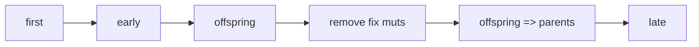

# Under the hood of SLiM

* Begin by opening SLiM and dont dont anything. Open the Eidos console and type

```c
ls();
```

## The Genomic Environment
 
Lets start with the basic simulation in SliM, and **run just the first 10 ticks**...

```c
// set up a simple neutral simulation
initialize() {
	initializeMutationRate(1e-7);
	
	// m1 mutation type: neutral
	initializeMutationType("m1", 0.5, "f", 0.0);
	
	// g1 genomic element type: uses m1 for all mutations
	initializeGenomicElementType("g1", m1, 1.0);
	
	// uniform chromosome of length 100 kb with uniform recombination
	initializeGenomicElement(g1, 0, 99999);
	initializeRecombinationRate(1e-8);
}
```
### now run `ls` again ...
```c
ls();
```

### Lets explore these new elements

```c
m1.methodSignature();
//+ (integer$)length(void)
//+ (void)methodSignature([Ns$ methodName = NULL])
//+ (void)propertySignature([Ns$ propertyName = NULL])
//+ (integer$)size(void)
//- (void)addKeysAndValuesFrom(object$ source)
//- (void)appendKeysAndValuesFrom(object source)
//- (void)clearKeysAndValues(void)
//- (integer)compactIndices([logical$ preserveOrder = F])
//- (float)drawSelectionCoefficient([integer$ n = 1])
//- (object<Dictionary>$)getRowValues(li index, [logical$ drop = F])
//- (*)getValue(is$ key)
//- (logical$)identicalContents(object$ x)
//- (string)serialize([string$ format = "slim"])
//- (void)setDistribution(string$ distributionType, ...)
//- (void)setValue(is$ key, * value)
//- (void)str(void)
//- (string$)stringRepresentation(void)

// "+" means a global property
// "-" means a per object property
```

```c
m1.propertySignature();
//allKeys => (is)
//color <-> (string$)
//colorSubstitution <-> (string$)
//convertToSubstitution <-> (logical$)
//distributionParams => (fs)
//distributionType => (string$)
//dominanceCoeff <-> (float$)
//haploidDominanceCoeff <-> (float$)
//id => (integer$)
//mutationStackGroup <-> (integer$)
//mutationStackPolicy <-> (string$)
//nucleotideBased => (logical$)
//species => (object<Species>$)
//tag <-> (integer$)

// <-> means means read and write propert
// => means read only property and is assigned by the simulation
```

### Mutations

#### Dominance Coefficients are inherent to all the mutations
```c
m1.dominanceCoeff
```

#### Selection Coefficients are inherent only to each invidual mutation
```c
mut = sim.mutationsOfType(m1);
mut.propertySignature();
```
* Change selection coefficient
```c
mut.selectionCoeff
mut[0:10].setSelectionCoeff(0.1);
mut.selectionCoeff
```

### Genomes

```c
g1.propertySignature();
g1.mutationTypes(); // --> error
// since we are only reporting
g1.mutationTypes;
g1.mutationFractions;
```

## The Ecology of the simulation

The ecology of individuals happens in a temporally explicit fashion:

```c
early()
{
sim.addSubpop("p1", 500);
}
```

### The wright-fisher model:
- no selection, 
- no mutation, 
- no migration, 
- non-overlapping generations 
- random mating

The probaility of sampling alleles is:

$$
P_{ij} = \binom{2N}{j}(\frac{i}{2N})^j(1-\frac{i}{2N})^{2N-j}
$$

### order of operations 




