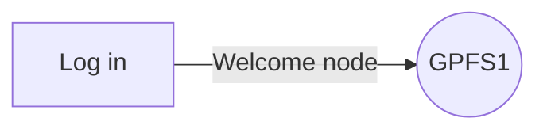
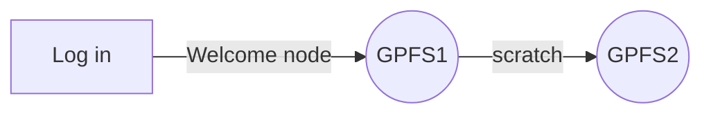
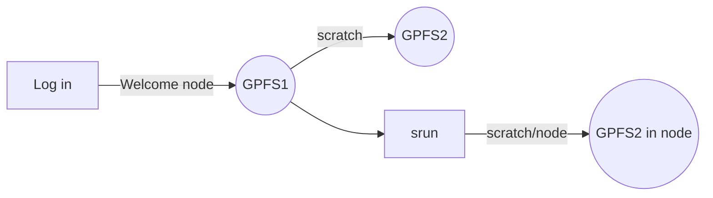

# Topic 1 (-pract): Intro to the VACC
Program in Biological Data Science and QuEST

## Understanding the VACC
An overly simplistic, yet intuitive introduction to our supercomputer.

1. Supercomputers do not exist in the cloud. They are physical things. We can interact with them via the internet (the cloiud?)
2. Supercompiters such as the VACC have equipmemnt that is devoted to various purposes. 
2.1. The analyses clusters
	* **Bluemoon**: A 161 node, 8392 core, high-performance computing cluster, modeled after national supercomputing centers, supporting large-scale computation, low-latency networking for MPI workloads, large memory systems, and high-performance parallel filesystems.
	* **DeepGreen**: DeepGreen is a new massively parallel cluster deployed in Summer 2019 with 80 GPUs capable of over 8 petaflops of mixed-precision calculations based on the NVIDIA Tesla V100 architecture.
	* **BlackDiamond**: This cluster is built using AMD’s 2nd Gen AMD EPYC processor, which pushes the boundaries for x86 performance, efficiency, security features, and overall system throughput.

	2.2. Storage 
	* **Netfiles:** P.I.s usually pay a fee to maintain long term storage. Soem storage is included in the faculty package. Trainees and staff are dependent on the PI. Ususally many people can access these files.

	2.3. File systems
	
	* **GPFS 1**: Your home directory. Only you can access this.  
	* **GPFS 2**: Your scratch directiry. Only you can access this.  

## What can we do in, and how we can access into, the VACC

## Stand-by flow ( checking files )

``
[yourusername@vacc-user1 somewhere]$
``

Do not run any programs or *heavy* commands while in a welcome node. Also note that GPFS 1 has a very "low" storage memory. This is not the place to store files

#### *where am I?*
``pwd``
#### *what is in here?*
``
ls``

## Interactive work flow ( coding as you go )

``cd scratch``


Scratch is the place where we will run most analyses. It is a fast and flexible parition of the supercomputer. Yet, files only exist there for 90 days. Not designed to be used for long term storage!

```
srun -N 1 -n 5 --mem=50G -t 3:00:00 --pty bash
srun: job 12417344 queued and waiting for resources
[yourusername@node321 somewhere]$
```


Afert running ``srun`` we are no longer in a welcome node and thus we can start running commands without "breaking the rules" of the vacc. Notice that by inhabiting node "321," or whichever node you got, you are now interacting with an entirely diferent "machine" that has 50G of RAM. You have reserved this machine for 3 hours, after that point the system will kick you out back to the welcome node. 

### *running your first command*
``
echo "hello world"
``

congratulations you are all coders now... if you were not one before!!

### *automation 101*

```
for i in world mars jupiter venus
do
echo hello $i
done
```
Notice that in this instance the letter ``i`` is transforming itself into a variable. the variable is being called in the code using the ``$`` simbol! The ``$`` symbol is key to distinguish the variable called ``i`` and the letter **i**. Very important distcintion!


### *numbered sequences*
```
for i in {1..5}
do
echo $i
done
```
Imagine looping from 1 to 5; easy ``for i in 1 2 3 4 5``.... Imagine looping from 1 to 1000000 ... less fun! try ``{a..b}`` (works in reverse too!).

### *creating arrays in memory*

#### define an array with three items 
``myarray=( mars jupiter moon world sun kaiper )``

To check the array we need to introduce some first bit of complexity
``echo ${myarray[@]}``
Yet, we can now use this to provide all the stuff we want into a loop
 ```
for i in "${myarray[@]}"
do
  echo $i
done
```

# VACC Cluster Specs (for your grant proposals)

Introduction

The Vermont Advanced Computing Center (VACC) is a core facility of UVM, managed by the Office of the Vice President for Research in partnership with UVM’s Enterprise Technology Services (ETS) in support of compute and data intensive research programs across disciplines. The VACC hosts CPU- and GPU-focused clusters.  

Our CPU cluster, “BlueMoon,” has 161 nodes, providing 8392 compute cores.  5120 of these cores are available via HDR Infiniband.

Additionally, VACC hosts a GPU cluster named DeepGreen, composed of 80 NVIDIA Tesla V100 SXM2 GPUs capable of over 8 petaflops of mixed precision calculations in aggregate. Each DeepGreen node is connected to its neighbors and NVMe storage by four HDR100 Infiniband connections. Its hybrid design can expedite high-throughput artificial intelligence and machine learning workflows, and its extreme parallelism allows for transformative research pipelines. It is well-suited to support training and inference using neural models.

The DataMountain cluster that the VACC hosts is focused on large-memory sharded MongoDB to support near real-time access to enormous data files, supporting projects that require such speed to effectively analyze, describe, and explain rapidly growing datasets.

The VACC also hosts a small cluster with 48 AMD MI50 GPUs named BlackDiamond. The VACC provides 100Gb, 40Gb, 25Gb, and 10Gb Ethernet connections to different portions of the cluster.
  
IBM Spectrum Scale (GPFS) filesystems are available for storing research data and software during computation.  These filesystems provide 1.6PB of storage, with roughly 20% of capacity housed on NVMe/Flash storage devices for performance.

SLURM is provided for scheduling and resource management. Open OnDemand is available to users who are less comfortable with the command-line or need a graphical interface.

The VACC provides a number of open-source software packages to users, as well as a variety of licensed application software, in-house community-developed code, and tools for usage. VACC also supports various libraries for chemistry, molecular dynamics, neural networks, and image processing, as well as support packages for building high-performance software applications.

Andrea Elledge (Program Director) is the current Administrative Director of the VACC, where she works in partnership with UVM’s Chief Technology Officer to oversee all HPC clusters, IT technicians, user growth, HPC education, and onboarding of new faculty and students. 

BlueMoon specs
*	39 dual-processor, 128-core AMD Epyc 7763 PowerEdge R6525 nodes, with 1TB RAM each. Mixed use: Infiniband connected HDR100 for file access as well as MPI communication along with 25Gb Ethernet
*	2 dual-processor, 128-core AMD Epyc 7763 PowerEdge R7525 nodes, with 1TB RAM each and 1 A100 GPU
*	1 dual-processor, 64-core EPYC 7543 PowerEdge R7525 node, with 4TB RAM. Infiniband connected HDR100 for file access, 10/25Gb Ethernet
*	32 dual-processor, 12-core (Intel E5-2650 v4) Dell PowerEdge R430 nodes, with 64GB RAM each, 10Gb Ethernet-connected
*	8 dual-processor, 12-core (Intel E5-2650 v4) Dell PowerEdge R430 nodes, with 256GB RAM each, 10Gb Ethernet-connected
*	9 dual-processor, 20 core (Intel 6230), PowerEdge R440, with 10GB RAM, 10Gb Ethernet-connected
*	3 dual-processor, 10-core (Intel E5-2650 v3) Dell PowerEdge R630 nodes, with 256GB RAM each, Ethernet-connected
*	40 dual-processor, 10-core (Intel E5-2650 v3) Dell PowerEdge R630 nodes, with 64GB RAM each, Infiniband 4XFDR (56Gb)-connected
*	2 dual-processor, 12-core (Intel E5-2650 v4) Dell R730, with 1TB RAM
*	1 dual-processor, 8-core (Intel E7-8837) IBM x3690 x5, with 512GB RAM
*	2 dual-processor, 12-core (Intel E5-2650 v4) Dell R730 GPU nodes, each with 2 Nvidia Tesla P100 GPUs
*	2 I/O nodes (Dell R740xd) with 40GbE, 200Gb HDR, along with 2 I/O nodes (Dell R430s, 10Gb Ethernet-connected) connected to:
*	1 Dell MD3460 providing 287TB storage to GPFS
*	1 Dell ME4084 providing 751TB of spinning disk storage
*	1 IBM FS7200 providing 187TB of NVMe-attached FlashCore Module storage
 
 
DeepGreen specs
*	10 GPU nodes (Penguin Relion XE4118GTS) each with:
*	2 Intel(R) Xeon(R) Gold 6130 CPU @ 2.10GHz (2x 16 cores, 22M cache)
*	768GB RAM (256GB for GPFS pagepool)
*	8 NVIDIA Tesla V100s with 32GB RAM
*	4 2-lane HDR (100Gb/s, so 400Gb/s/node) Infiniband links to QM8700 switch
*	2 NVMe nodes, each with 88TB NVMe devices (12x8TB), replicated to provide dedicated 88TB NVMe-over-fabrics filesystem
*	Mellanox QM8700 switch running at HDR speeds


DataMountain specs
*	8 large memory nodes (HPe DL380G10P) each with:
*	2 Intel Xeon 6348 CPUs
*	8TB of Intel Optane PMem in memory mode plus 1TB DRAM for memory
*	10 7.68TB NVMe storage devices
*	25Gb Ethernet


BlackDiamond Specs
*	6 GPU nodes, each with:
*	1 AMD EPYC 7642 48-core processor
*	8 AMD Radeon Instinct MI50 Accelerators (32GB)
*	512GB DDR4-3200MHz RAM
*	HDR100 Infiniband links to QM8700 switch


