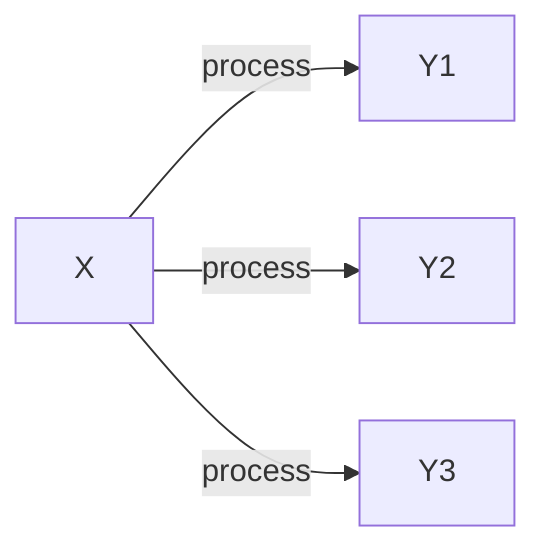

# Topic 1: Introduction to FQR + Evolutionary first principles
---
# Goals
1. Introduce ourselves 
2. Understand the structure of the course + syllabus
3. Review of evolutionary principles
* Deterministic Processess
* Stochastic Processes
* Evolutionary Systems through the lenses of Deterministic and Stochastic Processes
4. (If time permits), a tour of the VACC
---
# Evolutionary Theory...
... that living things are systems that change over space and time.

## These changes are driven by processes that can be measured and predicted (to some degree)
1.Some processes are deterministic: Have predictable outcomes that are repeatable and devoid of randomness
*Useful sometimes to think of point estimates as predictive outcomes
2.Some processes are stochastic: Have outcomes, that can be described, yet they governed by randomness
*Useful to think of distributions as “predictive” outcomes 

## Example of Deterministic processes 

## Example of Stochastic processes 

