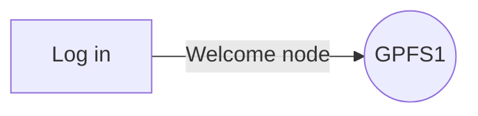
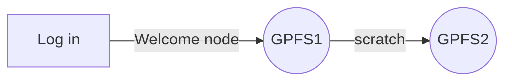
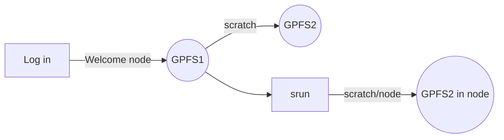

# Topic 1 (-pract): Intro to the VACC
Program in Biological Data Science and QuEST

## Understanding the VACC
An overly simplistic, yet intuitive introduction to our supercomputer.

1. Supercomputers do not exist in the cloud. They are physical things. We can interact with them via the internet (the cloiud?)
2. Supercompiters such as the VACC have equipmemnt that is devoted to various purposes. 
2.1. The analyses clusters
	* **Bluemoon**: A 161 node, 8392 core, high-performance computing cluster, modeled after national supercomputing centers, supporting large-scale computation, low-latency networking for MPI workloads, large memory systems, and high-performance parallel filesystems.
	* **DeepGreen**: DeepGreen is a new massively parallel cluster deployed in Summer 2019 with 80 GPUs capable of over 8 petaflops of mixed-precision calculations based on the NVIDIA Tesla V100 architecture.
	* **BlackDiamond**: This cluster is built using AMD’s 2nd Gen AMD EPYC processor, which pushes the boundaries for x86 performance, efficiency, security features, and overall system throughput.

	2.2. Storage 
	* **Netfiles:** P.I.s usually pay a fee to maintain long term storage. Soem storage is included in the faculty package. Trainees and staff are dependent on the PI. Ususally many people can access these files.

	2.3. File systems
	
	* **GPFS 1**: Your home directory. Only you can access this.  
	* **GPFS 2**: Your scratch directiry. Only you can access this.  

## What can we do in, and how we can access into, the VACC

## Stand-by flow ( checking files )

``
[yourusername@vacc-user1 somewhere]$
``

Do not run any programs or *heavy* commands while in a welcome node. Also note that GPFS 1 has a very "low" storage memory. This is not the place to store files

#### *where am I?*
``pwd``
#### *what is in here?*
``
ls``

## Interactive work flow ( coding as you go )

``cd scratch``


Scratch is the place where we will run most analyses. It is a fast and flexible parition of the supercomputer. Yet, files only exist there for 90 days. Not designed to be used for long term storage!

```
srun -N 1 -n 5 --mem=50G -t 3:00:00 --pty bash
srun: job 12417344 queued and waiting for resources
[yourusername@node321 somewhere]$
```


Afert running ``srun`` we are no longer in a welcome node and thus we can start running commands without "breaking the rules" of the vacc. Notice that by inhabiting node "321," or whichever node you got, you are now interacting with an entirely diferent "machine" that has 50G of RAM. You have reserved this machine for 3 hours, after that point the system will kick you out back to the welcome node. 

### *running your first command*
``
echo "hello world"
``

congratulations you are all coders now... if you were not one before!!
