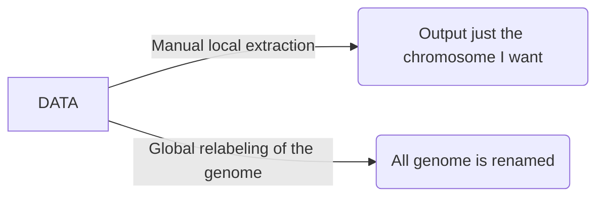

# *Data challenge* my genome file and my annotation file do not match! *mon dieu!*

A problem as old as time (not really, but humor me). As computational biologists we are often interested in investigating DNA sequences not just at the level of nucleotides but their potential funtional consequences. The challenge, however, is that, due to the inherent data complexity of DNA data, sequence data, variation data, and functional data are stored in different format that may not integrate into each other in an intuitive way. For example

1. The *standard* way of storing DNA sequences is the FASTA file
```
>NAME of sequences (e.g., "chromosome 2L" gene, chromosome scaffold); ind1"
ACTGACTGACTGCGTGGCC...
>NAME of sequences (e.g., "chromosome 2L" gene, chromosome scaffold); ind2"
ACTGACTGACTGCGCGGCC...
>NAME of sequences (e.g., "chromosome 2L" gene, chromosome scaffold); ind3"
ACTGACTGACTGCCTGGCC...
```
2. The *standard* way of storing variation among sequences is the VCF file
```
>##fileformat=VCFv4.3
##fileDate=...
##source=...
##reference=...
##contig=<taxonomy=info>
##phasing=....
##INFO=<....>
##FILTER=<....>
##FORMAT=<....>
```
|CHROM|POS |ID|REF|ALT|QUAL|FILTER|INFO|FORMAT|ind1|ind2|ind3|
|--|-- |--|--|--|--|--|--|--|--|--|--|
X  |   12345  |  snp_111  | G  |   A   |   29  |  PASS   | NS=3;DP=14;AF=0.5;DB;H2   |  GT:GQ:DP:HQ  | 0/0:48:1:51,51 |  1/0:48:8:51,51   |1/1:43:5:.,.|
2L  |   1258  |  snp_125  | C  |   T   |   29  |  PASS   | NS=3;DP=14;AF=0.5;DB;H2   |  GT:GQ:DP:HQ  | 0/0:89:1:25,51 |  0/1:48:8:78,51   |1/0:43:5:.,.|

3. The *standard* way of storing annotations in genomes is some form of GFF file (gene/generic/general feature files; or similar)

| seqid | source | type | start | end | score | strand | phase | attributes |
| -- | -- | -- | -- | -- | -- | -- | -- | -- |
| chr2L | MAKER | gene | 5600 | 8900 | 0.95 | + | 2 | gene QXD1 |
| chr3R | BUSCO | exon | 15899 | 157800 | 0.65 | - | 0 | gene ppk785 |


## Case study for *Pycnopodia*

**A haplotype of interest**: A study in the sea star _Pycnopodia_ has identified several genes of  interest. We would like to extract these genes from the genome of pycno for further study. 

I have already downloaded the genome from NCBI and have stored it in our shared VACC repository.
```
ls /gpfs1/cl/biol6990/prac2/pycno_genome.fasta
```

## Adquiring the genome

1. Move to your scratch directory **(known skill!)**
2. create a working folder for this challenge
```
mkdir pycno_challenge
```
3. move into your new folder
```
cd pycno_challenge
```
4. Check what is inside this new folder
```
ls -l ./
##this is the same as just ls -l
```
5. Copy the genome from the repo to your folder
```
cp /gpfs1/cl/biol6990/prac2/pycno_genome.fasta ./
## cp <from+file> <to>
```
6. Check what is inside this new folder... again.
```
ls -l ./
```

## Exploring the genome
Explore the heads and tails command
```
head -n 50 pycno_genome.fasta
## head -n <nlines> <file>
```

```
tail -n 50 pycno_genome.fasta
## tail -n <nlines> <file>
```

## Adquiring the gene feature file
```
cp /netfiles/nunezlab/FQR_files/GeneFeatureFile.gtf
head -n 10 GeneFeatureFile.gtf
```
Do we observe something strange?  ... What is going on?

## Emailing the author...

**You**: Dear author, I am interested in conducting follow up analyses on the genome of *Pycnopodia* that you published in 2018. I am interested in extracting  some loci. Yet, when I download the genome from NCBI, the chromosomes are labebled with the standard NCBI genomic nomenclature (JASTWB0100...) and I cannot cross-validate scaffold "pycn_heli.0008". Do you have any thoughts about how to cross-validate scaffolds?

---
**Author**: Dear X, my appologies that you are experiencing this road block! Our analyses was conducted before the genome was made public using our own chromosome nomenclature. Here is a file with the corresponding association of the "pycn_heli" names with the JASTWB ids.

```
cp /gpfs1/cl/biol6990/prac2/JASTWB01_contigs.tsv ./
```
---
## Exploring the corresponding file
```
head JASTWB01_contigs.tsv
```

# What to do?


What is  the **best use of your time**? ... What is the **best use of *future you's* time**? For example what about if later on you want to look at many other loci.. or if you had multiple loci to extract to begin with. I submit to you that a global solution that re-labels the genome is the overall most efficient solution, despite having a larger initial investment (i.e., having to code the relabeling pipeline) it will be an overall more efficient use of research resources.
  
## Breaking down the code (lets take a reverse engineering approach!).
Lets break down what is going on here .... the _stack overflow_ approach! 
>**lets talk about stack overflow** for one minute...
```
master_file=./JASTWB01_contigs.tsv
working_file=./pycno_genome.fasta 

cp $working_file ./pycno_genome_modnames.fasta

ith=$(cat $master_file | sed '1d' | wc -l)

for i in $(seq $ith)
 do
  name1=$(cat $master_file |  sed '1d' | awk '{print $1}' | sed "${i}q;d" )
  name2=$(cat $master_file |  sed '1d' | awk '{print $2}' | sed "${i}q;d" )
   echo "im an changing " $name2 " to " $name1 " as per " $i
   sed -E -i "s/${name2}.+/${name1}/g" pycno_genome_modnames.fasta
 done
``` 
### Annotated code...
```
### Variables declared by the user... <more details>
master_file=./JASTWB01_contigs.tsv
working_file=./pycno_genome.fasta 

### File generated in situ (to create data redundancy!; failsafe) ... <more details>
cp $working_file ./pycno_genome_modnames.fasta

### Create a varible with number of itherations ... <more details
ith=$(cat $master_file | sed '1d' | wc -l)

### Loop around the genome to rename all the chromosomes to a different name
for i in $(seq $ith)
 do
  name1=$(cat $master_file |  sed '1d' | awk '{print $1}' | sed "${i}q;d" )
  name2=$(cat $master_file |  sed '1d' | awk '{print $2}' | sed "${i}q;d" )
   echo "im an changing " $name2 " to " $name1 " as per " $i
   sed -E -i "s/${name2}.+/${name1}/g" pycno_genome_modnames.fasta
 done
``` 
## What are the parts of the code?
### Variables declared by the user
```
master_file=./JASTWB01_contigs.tsv
working_file=./pycno_genome.fasta 
```
here we are declaring environmental variables. This is a convient way to pass information to our script, code, multiple times while having user provided imput just once. Imagine how cumbersone it would to have to change one small paramter 30 times across a script.. vs. declaring a global parameter once ... and changing just that!

In unix, variables are often declared with the `=` simbol and recalled with the `$` symbol. We can always spot check a variable using `echo`. lets explore some variables... **NO SPACES ALLOWED between `=` and the other stuff!**

### File generated in situ (to create data redundancy!; _failsafe_)
Why is the code asking us to do this? The reality is that it is not necessary but it is a failsafe custom. Basically, the way this code works, it constantly overwrites the original file. What about if we get this wrong? An easy solution is to introduce redundancy and safety copies to the process. 
```
cp $working_file ./pycno_genome_modnames.fasta
```
#### Commands to keep in mind:
1. `cp` copy `cp <file> <location>`
2. `mv` move or (oddly) rename `mv <file> <location>`

### Create a varible with number of itherations & introduction to loops
Before we can get at what the the `ith` varaiable means, we first need to take a deep dive into _loops_.


#### A basic loop 1
```
for i in A B C
do
echo $i
done
```
#### Creating a sequence with `seq`
```
seq 10
#seq --help
```
#### A basic loop 2
```
for i in $(seq 10)
do
echo $i
done
```
Here we are using the power of the `$()` construction to transform the output of the `seq` function into a variable that is, at the same time, the input of the loop itself. This reveals the first path to "scaling up the code" because we can **nest** these variables into each other... `$(seq $a)`.
```
a=15
for i in $(seq $a)
do
echo $i
done
```
#### On local vs. global variables
Notice that our loop has two variables.. it has `a`, that is globally set, and it has `i`, that iterates inside the loop... **keep track of your variables!**  

### What does _loops_ have to do with `ith`
At this point we have covered loops. Yet, notice that we have always given the loop... either the actual objects to iterate over (`A B C`) or a number of given iterations `seq 15`. What about if we dont know how many iteration our loop may need?  That is the purpose of defining `ith`
```
master_file=./JASTWB01_contigs.tsv
ith=$(cat $master_file | sed '1d' | wc -l)
```
#### The layers of `ith`
1. `ith` is a global variable
2. `ith` is the output of nested commands ... `$()`
3. These command a **piped workflow** of commands `cat` --> `sed` --> `wc`

#### 1. Piped workflow


### Implementing a loop with a replacement command in it!
```
for i in $(seq $ith)
 do
  name1=$(cat $master_file |  sed '1d' | awk '{print $1}' | sed "${i}q;d" )
  name2=$(cat $master_file |  sed '1d' | awk '{print $2}' | sed "${i}q;d" )
   echo "im an changing " $name2 " to " $name1 " as per " $i
   sed -E -i "s/${name2}.+/${name1}/g" pycno_genome_modnames.fasta
 done
``` 